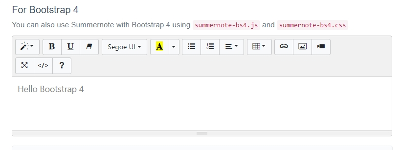

<p align="center"><a href="https://laravel.com" target="_blank"></a></p>

---
# Portfolio Project - Laravel Developer
This repository contains my Laravel portfolio project, which showcases my skills as a Laravel developer. As I build this project, I'm learning new techniques and concepts that I'll document here for future reference.

## New Learnings

### 1. Adding Conditional Classes in Blade Templates
**File:** `service.blade.php`

```php
@foreach ($services as $service)
    <div class="col-lg-4 {{ $loop->index > 2 ? 'mt-4' : '' }}">
        <div class="single-service">
            <h3 class="title wow fadeInRight" data-wow-delay="0.3s">{{ $service->name }}</h3>
            <div class="desc wow fadeInRight" data-wow-delay="0.4s">
                <p>{{ $service->description }}</p>
            </div>
        </div>
    </div>
@endforeach
```
### What I Learned:
In this code, I learned how to use the ```{{ $loop->index > 2 ? 'mt-4' : '' }}``` logic inside Blade templates to conditionally apply CSS classes. Specifically, this adds a top margin (mt-4) to cards after the third card (index > 2). This is helpful for customizing layout behavior based on the loop index.

### 2. Adding Summernote Text Editor


I integrated the Summernote WYSIWYG editor into my project, which allows for rich text editing in forms. It supports a wide range of formatting options and media embedding, making it easy to style content directly within the application.

You can learn more about Summernote [here](https://summernote.org/).


